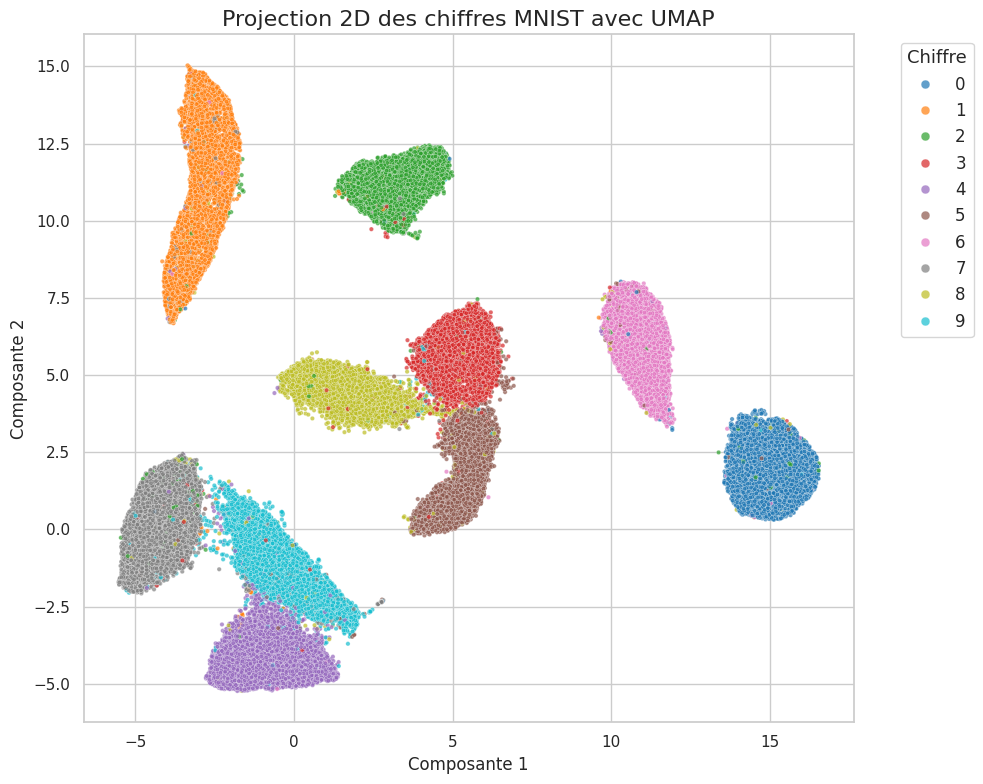
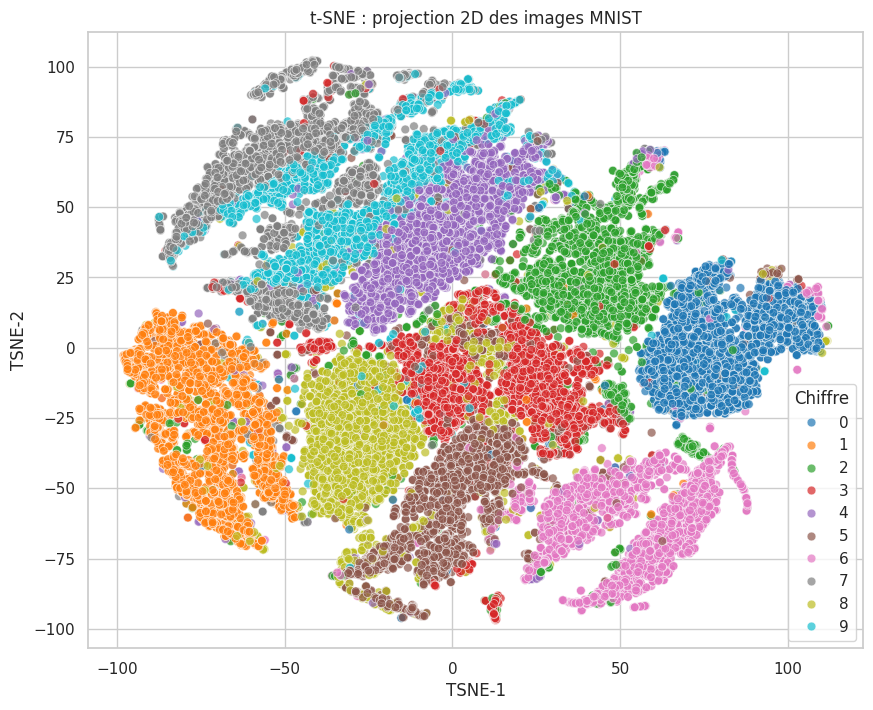
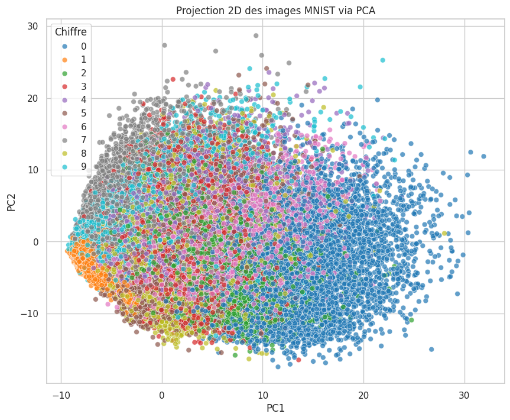
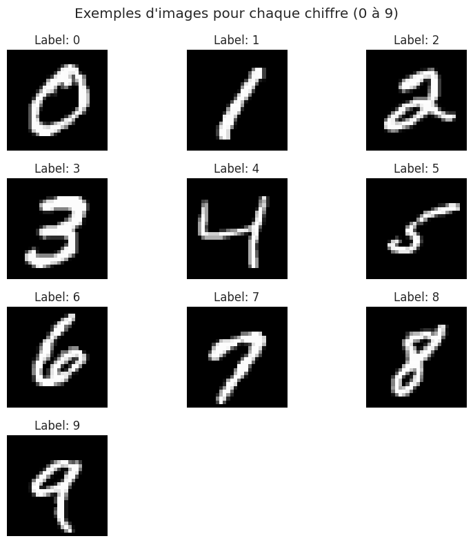

# 🧠 MNIST Dimension Reduction

Ce projet explore et compare trois techniques de **réduction de dimension** appliquées au célèbre dataset **MNIST** (images de chiffres manuscrits). L’objectif est de transformer des données initialement en **784 dimensions** (28x28 pixels) vers **2 ou 3 dimensions** pour :
- Faciliter la **visualisation**,
- Réduire la complexité des modèles,
- Améliorer certaines étapes de **clustering ou classification**.

---

## 🎯 Objectifs pédagogiques

Ce projet a été conçu pour :
- Comprendre les **principes fondamentaux** de la réduction de dimension.
- Comparer les méthodes **linéaires (PCA)** et **non-linéaires (t-SNE, UMAP)**.
- Visualiser l’impact des réductions sur la séparation des classes.
- Analyser l’utilité de ces techniques en **prétraitement** avant clustering ou apprentissage supervisé.

---

## 📊 Techniques étudiées

| Méthode | Type | Avantages | Limites |
|--------|------|-----------|---------|
| **PCA** | Linéaire | Simple, rapide, interprétable | Ne capte pas les relations non linéaires |
| **t-SNE** | Non-linéaire | Très bon pour la visualisation locale | Coûteux, pas généralisable |
| **UMAP** | Non-linéaire | Rapide, préserve mieux la structure globale | Paramétrage plus complexe |

---

## 🧱 Structure du projet

```

mnist-dimension-reduction/
│
├── README.md                   # Documentation du projet
├── requirements.txt            # Bibliothèques à installer
├── .gitignore                  # Fichiers/dossiers à ignorer par Git
│
├── data/                       # Données d'entrée (CSV MNIST)
│   └── mnist.csv
│
├── notebooks/                  # Notebooks Jupyter pour chaque méthode
│   ├── 01\_pca\_mnist.ipynb
│   ├── 02\_tsne\_mnist.ipynb
│   ├── 03\_umap\_mnist.ipynb
│   └── 04\_comparaison.ipynb
│
└── visualisations/             # Graphiques et figures générés
└── figures/

````

---

## ⚙️ Installation et exécution

```bash
# Cloner le repo
git clone https://github.com/ThePerformer0/mnist-dimension-reduction.git
cd mnist-dimension-reduction

# Créer un environnement virtuel
python3 -m venv venv
source venv/bin/activate

# Installer les dépendances
pip install -r requirements.txt
````

---

## 🧪 Datasets

Nous utilisons le dataset MNIST au format CSV :

* Lien Kaggle : [MNIST CSV Format – Aditya Kashyap](https://www.kaggle.com/datasets/adityaanilkashyap/the-mnist-dataset-in-csv-format)
* Contenu : 70 000 échantillons (60k train + 10k test), avec labels inclus
* Format : chaque ligne contient un label (0 à 9) suivi des 784 pixels

---

## 📈 Résultats obtenus

### Comparaison visuelle des trois méthodes

Les figures ci-dessous montrent les projections 2D obtenues avec chaque méthode sur un échantillon du dataset MNIST :



*Figure 1 : Projection 2D avec UMAP - Séparation optimale des classes*



*Figure 2 : Projection 2D avec t-SNE - Bonne séparation locale*



*Figure 3 : Projection 2D avec PCA - Séparation limitée*



*Figure 4 : Exemples d'images pour chaque chiffre (0-9)*


| Méthode | Qualité de séparation | Structure préservée | Temps de calcul |
|---------|---------------------|-------------------|----------------|
| **UMAP** | ⭐⭐⭐⭐⭐ Excellente | Globale + Locale | Rapide |
| **t-SNE** | ⭐⭐⭐⭐ Très bonne | Principalement locale | Lent |
| **PCA** | ⭐⭐ Limitée | Linéaire uniquement | Très rapide |

### Observations par méthode

#### 🎯 UMAP - La plus performante
- **Séparation optimale** : Chaque chiffre forme des clusters distincts et bien définis
- **Structure préservée** : Maintient à la fois les relations locales et globales
- **Chiffres parfaitement isolés** : 0, 1, 2, 4, 6, 9 forment des îlots complètement séparés
- **Zones de confusion minimales** : Léger chevauchement uniquement entre 3, 5, 8 (chiffres morphologiquement similaires)

#### 🔍 t-SNE - Bonne visualisation locale
- **Clusters visibles** : Séparation claire de la plupart des chiffres
- **Structure locale excellente** : Préserve bien les voisinages proches
- **Chevauchements plus nombreux** : Zones de mélange entre plusieurs classes
- **Disposition moins optimale** : Certains clusters proches peuvent créer de la confusion

#### 📊 PCA - Méthode linéaire limitée
- **Séparation insuffisante** : Forte superposition de la majorité des classes
- **Structure circulaire** : Disposition en nuage sans clusters distincts
- **Seul le chiffre 1 se distingue** : Légèrement séparé du nuage principal
- **Inadéquate pour MNIST** : Les relations non-linéaires ne sont pas capturées

---

## 🧠 Interprétations & analyses

### Ce qu'on apprend sur la nature des données MNIST

1. **Complexité non-linéaire** : Les chiffres manuscrits présentent des variations qui ne peuvent pas être capturées par une transformation linéaire simple (échec de PCA).

2. **Structure intrinsèque** : Malgré la haute dimensionnalité (784 dimensions), les données possèdent une structure sous-jacente de dimension bien plus faible, révélée par UMAP et t-SNE.

3. **Similarités morphologiques** : Les confusions observées (3/5/8, 4/9, 6/8) reflètent les similarités visuelles réelles entre ces chiffres dans l'écriture manuscrite.

### Utilité en prétraitement

#### Pour le clustering non-supervisé
- **UMAP recommandé** : Préservation optimale de la structure pour des algorithmes comme K-means
- **t-SNE acceptable** : Mais risque de sur-optimisation pour la visualisation
- **PCA déconseillé** : Perte d'information critique

#### Pour la classification supervisée
- **UMAP** : Excellent prétraitement, réduction significative de la dimensionnalité sans perte de séparabilité
- **PCA** : Peut être utilisé pour une réduction rapide en première étape, mais insuffisant seul
- **t-SNE** : Non recommandé (pas de transformation out-of-sample)

### Cas d'usage optimaux par méthode

#### Choisir UMAP quand :
- On souhaite la **meilleure séparation possible**
- Il faut préserver à la fois la **structure locale et globale**
- Le dataset est de **taille moyenne à grande**
- On veut un **prétraitement performant** pour du clustering/classification

#### Choisir t-SNE quand :
- L'objectif principal est la **visualisation exploratoire**
- On s'intéresse aux **relations de proximité locale**
- Le dataset est de **taille modérée**
- Le temps de calcul n'est **pas critique**

#### Choisir PCA quand :
- On a besoin d'une **réduction rapide**
- L'**interprétabilité** des composantes est importante
- Il faut une méthode **déterministe et reproductible**
- C'est une **première étape** avant d'autres techniques

---

## 🔗 Ressources utiles

* [scikit-learn – PCA & t-SNE](https://scikit-learn.org/stable/modules/manifold.html)
* [UMAP-learn Documentation](https://umap-learn.readthedocs.io/en/latest/)
* [MNIST Dataset Info – Yann LeCun](http://yann.lecun.com/exdb/mnist/)

---

## 🤝 Contribution

Toute contribution (amélioration du code, meilleure visualisation, benchmark additionnel…) est la bienvenue !
Pour contribuer :

1. Fork le projet
2. Crée une branche
3. Propose un Pull Request

---

## 🧑‍💻 Auteur

Projet réalisé par [The Performer](https://github.com/ThePerformer0) dans un but éducatif et de partage.
